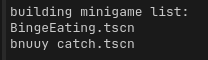
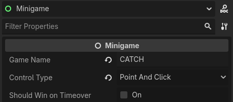

# Creating a new Minigame
Minigames are loaded automatically from the `Minigames` folder:

A function in `main.gd` called `build_minigame_list` will look for an `.tscn` with a name that matches its folder, such is these:
```
Minigames/
├─BingeEating/
│ └─BingeEating.tscn <-- this is a minigame
└─bnuuy catch/
  └─bnuuy catch.tscn <-- this is a minigame
```

## Set-up steps
- Create a folder in `Minigames` for your game.
- Pick a template from `Minigames` or `Example Minigames`, you'll usually want to use `2d_game.tscn`. Right click and create a "New Inherited Scene".
- Save the new scene, remember to give it the same name is the folder it's in.
- If you've done it right, it should be printed to the console when you launch the game:



## Configuring
If you click on the root node of your minigame you'll see the minigame settings in the inspector panel.



Hover over them to see a description of each setting. These settings may change as we update the game.

# API Reference

Feel free to peruse the code, the other minigames, or the example minigames. Here is a quick reference:

## Minigame

This is the root node of your game.
```gd
Minigame.get_game(self) # acquire a reference to the current minigame

Minigame.get_game(self).screenshake() # Screenshake effect. Hopefully more effects to come

# You will need to add either a win condition or a lose condition depending on `should_win_on_timeover`
Minigame.win_game(self)
Minigame.lose_game(self)
```

## Sound Effects

SFX are loaded automatically from the `audio/bitcrushed_sfx` and `audio/plain_sfx` folders. You can play SFX like this:
```gd
Sfx.play_sfx("bell") # plays res://audio/bitcrushed/general/bell.wav
Sfx.play_sfx("coin") # plays res://audio/bitcrushed/8-bit/coin.wav
```
Most of the SFX are from the Warioware DIY in-game soundboard. We bitcrush our SFX to make them all sound consistent with the Warioware ones.

If you want to add new SFX you can do one of the following:
1. Put your audio file in `audio/plain_sfx`
2. Put your audio file in `audio/raw` folder and run `bitcrush.sh` (you'll need ffmpeg and a shell script interpreter.

Of course, you always have the option to option to play audio yourself from an AudioStreamPlayer within your own game.

